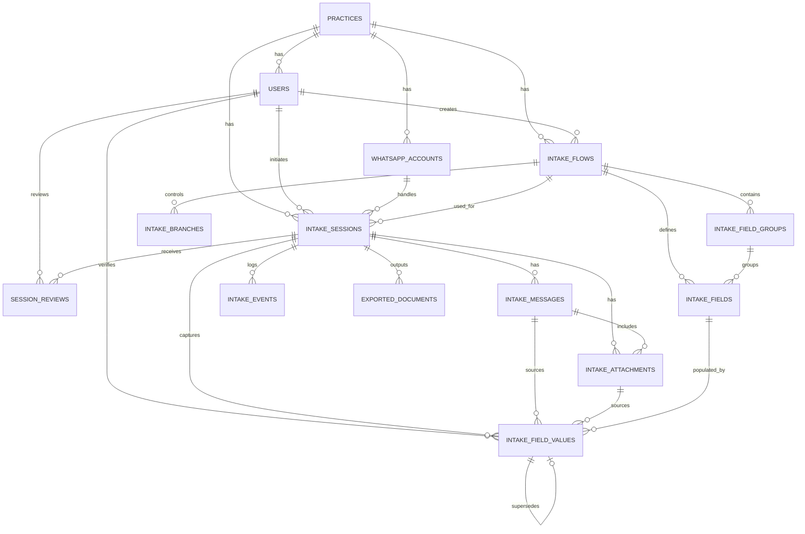
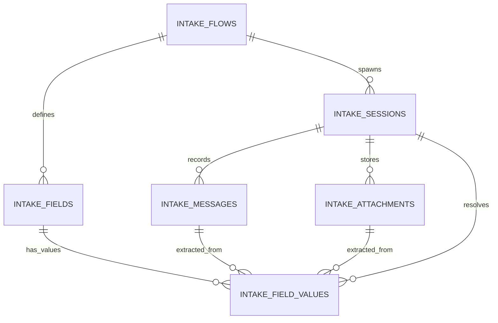

# MediComm ERD (Entity Relationship Diagram)

## High-level ERD



---

## Core Runtime Model



---

## Table Definitions

### PRACTICES
- id (PK)
- name
- slug
- timezone
- contact_email
- status

### USERS
- id (PK)
- practice_id (FK)
- first_name
- last_name
- email
- encrypted_password
- role
- active

### WHATSAPP_ACCOUNTS
- id (PK)
- practice_id (FK)
- phone_number_id
- waba_id
- display_phone_number
- access_token_ciphertext
- business_account_name
- active

### INTAKE_FLOWS
- id (PK)
- practice_id (FK)
- created_by_id (FK)
- name
- flow_type
- status
- description
- default_language
- tone_preset
- allow_skip_by_default
- completion_email_enabled
- completion_email_recipients_json
- published_at

### INTAKE_FIELD_GROUPS
- id (PK)
- intake_flow_id (FK)
- key
- label
- position
- repeatable
- visibility_rules_json

### INTAKE_FIELDS
- id (PK)
- intake_flow_id (FK)
- intake_field_group_id (FK)
- key
- label
- field_type
- required
- ask_priority
- extraction_enabled
- source_preference
- validation_rules_json
- branching_rules_json
- skip_rules_json
- ai_prompt_hint
- example_values_json
- autofill_pdf_key
- active

### INTAKE_SESSIONS
- id (PK)
- practice_id (FK)
- intake_flow_id (FK)
- whatsapp_account_id (FK)
- initiated_by_user_id (FK)
- patient_phone_e164
- patient_display_name
- external_reference
- status
- language
- started_at
- completed_at

### INTAKE_MESSAGES
- id (PK)
- intake_session_id (FK)
- direction
- provider_message_id
- message_type
- text_body

### INTAKE_ATTACHMENTS
- id (PK)
- intake_session_id (FK)
- intake_message_id (FK)
- mime_type
- s3_key

### INTAKE_FIELD_VALUES
- id (PK)
- intake_session_id (FK)
- intake_field_id (FK)
- canonical_value_text
- status
- confidence

### INTAKE_EVENTS
- id (PK)
- intake_session_id (FK)
- event_type
- payload_json
```
